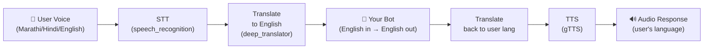

# How to Integrate Voice Input Into Your Existing Bot

## Architecture Overview

Your project is a **voice wrapper** around any chatbot. It adds multilingual voice I/O without touching your bot's core logic. Here's the full pipeline:



> [!IMPORTANT]
> Your existing bot only ever sees **English text** and returns **English text**. Translation and speech are handled entirely by the wrapper — you don't need to modify your bot for language support.

---

## The Only File You Need to Change

**[chatbot_interface.py](file:///c:/Users/Ajinkya/Desktop/MyBot/bot/chatbot_interface.py)** — specifically the `get_bot_response()` function on line 32.

This function:
- **Receives**: A `str` (user's message, **already translated to English**)
- **Returns**: A `str` (your bot's answer, **in English**)

Everything else in the project (STT, translate, TTS, routes, frontend) stays untouched.

---

## Option A: Your Bot Has an HTTP API

If your existing bot is a deployed service with a REST endpoint (e.g., Rasa, Dialogflow, custom Flask/FastAPI bot):

### Step 1 — Set environment variables in `.env`

```env
CHATBOT_API_URL=https://your-bot-endpoint.com/api/chat
CHATBOT_API_KEY=your_bot_api_key_if_needed
```

### Step 2 — Uncomment the API call in `chatbot_interface.py`

```python
async def get_bot_response(user_message: str) -> str:
    # Uncomment this line:
    if CHATBOT_API_URL:
        return await _call_real_bot_api(user_message)

    # Keep mock as fallback
    return _mock_response(user_message)
```

### Step 3 — Adjust the request/response format (if needed)

In [_call_real_bot_api()](file:///c:/Users/Ajinkya/Desktop/MyBot/bot/chatbot_interface.py#L64-L114), update the `payload` dict to match your bot's API contract:

```python
# If your bot expects { "query": "...", "user_id": "..." }
payload = {
    "query": user_message,        # Change key name to match your API
    "user_id": "voice-user-001",  # Add any extra fields your API needs
}
```

And update the response parsing:

```python
# If your bot returns { "reply": "...", "confidence": 0.95 }
bot_answer = data.get("reply")   # Change to match your API's response field
```

---

## Option B: Your Bot Is a Python Class/Function

If your bot is a Python module (e.g., LangChain chain, custom RAG, a local model):

### Step 1 — Import your bot in `chatbot_interface.py`

```python
# At the top of chatbot_interface.py, add your import:
from your_bot_module import YourBot

# Initialize once (outside the function for efficiency)
bot = YourBot(api_key="...", model="...")
```

### Step 2 — Call it in `get_bot_response()`

```python
async def get_bot_response(user_message: str) -> str:
    # If your bot is synchronous:
    return bot.respond(user_message)

    # If your bot is async:
    return await bot.arespond(user_message)
```

### Example with LangChain

```python
from langchain.chat_models import ChatOpenAI
from langchain.schema import HumanMessage

llm = ChatOpenAI(model="gpt-4", temperature=0.7)

async def get_bot_response(user_message: str) -> str:
    response = llm.invoke([HumanMessage(content=user_message)])
    return response.content
```

### Example with a RAG Chain

```python
from your_rag_module import rag_chain  # Your existing RAG setup

async def get_bot_response(user_message: str) -> str:
    result = rag_chain.invoke({"query": user_message})
    return result["answer"]
```

---

## Option C: Your Bot Uses WebSocket / gRPC / Queue

Replace the body of `get_bot_response()` with whatever client logic you need:

```python
async def get_bot_response(user_message: str) -> str:
    # WebSocket example
    async with websockets.connect("ws://your-bot:8080/ws") as ws:
        await ws.send(user_message)
        return await ws.recv()
```

---

## Required Setup

### 1. Install dependencies

```bash
pip install -r requirements.txt
```

Additionally install:
- `SpeechRecognition` and `gTTS` and `deep-translator` (used by the services but not in the current requirements.txt):

```bash
pip install SpeechRecognition gTTS deep-translator
```

### 2. Install ffmpeg (required for audio format conversion)

| OS | Command |
|---|---|
| Windows | `choco install ffmpeg` |
| macOS | `brew install ffmpeg` |
| Ubuntu | `sudo apt install ffmpeg` |

### 3. Configure `.env`

```env
# Required for your bot (adjust as needed)
CHATBOT_API_URL=https://your-bot.com/api/chat
CHATBOT_API_KEY=your_key

# Optional
DEBUG=true
APP_HOST=0.0.0.0
APP_PORT=8000
```

### 4. Run

```bash
python main.py
```

- UI: **http://localhost:8000**
- API docs: **http://localhost:8000/docs**

---

## API Endpoints Available After Integration

| Method | Endpoint | Input | Description |
|--------|----------|-------|-------------|
| `POST` | `/api/voice/` | Audio file + lang | Full voice pipeline (STT → Bot → TTS) |
| `POST` | `/api/voice/text` | JSON `{"text": "...", "language": "mr"}` | Text input pipeline (Bot → TTS) |
| `GET` | `/api/voice/languages` | — | List supported languages |
| `GET` | `/health` | — | Health check |

---

## Project File Map

| File | Role | Do you edit it? |
|------|------|-----------------|
| [main.py](file:///c:/Users/Ajinkya/Desktop/MyBot/main.py) | FastAPI app entry point, CORS, mounts routes | ❌ No |
| [routes/voice.py](file:///c:/Users/Ajinkya/Desktop/MyBot/routes/voice.py) | API endpoints, orchestrates the pipeline | ❌ No |
| [services/stt.py](file:///c:/Users/Ajinkya/Desktop/MyBot/services/stt.py) | Speech-to-Text (Google free API via SpeechRecognition) | ❌ No |
| [services/translate.py](file:///c:/Users/Ajinkya/Desktop/MyBot/services/translate.py) | Translation (deep-translator / Google Translate) | ❌ No |
| [services/tts.py](file:///c:/Users/Ajinkya/Desktop/MyBot/services/tts.py) | Text-to-Speech (gTTS) | ❌ No |
| [bot/chatbot_interface.py](file:///c:/Users/Ajinkya/Desktop/MyBot/bot/chatbot_interface.py) | **🔌 Your bot plugs in here** | ✅ **YES** |
| [public/](file:///c:/Users/Ajinkya/Desktop/MyBot/public) | Frontend UI (HTML + JS + CSS) | ❌ No (unless customizing UI) |

---

## Summary

1. **You only edit one function**: `get_bot_response()` in `bot/chatbot_interface.py`
2. **Your bot speaks English only** — all translation is handled automatically
3. **Your bot deals with text only** — all speech conversion is handled automatically
4. Choose Option A (HTTP API), B (Python import), or C (WebSocket/other) based on how your existing bot is accessed
