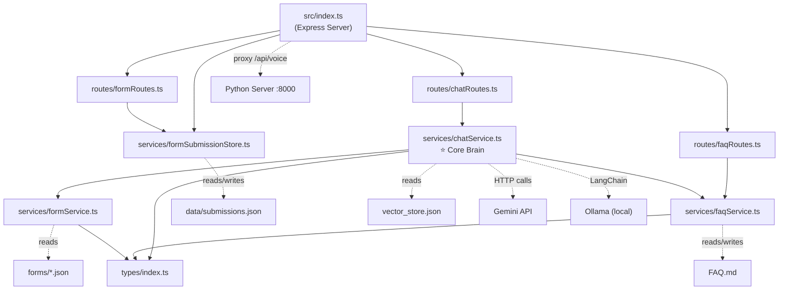
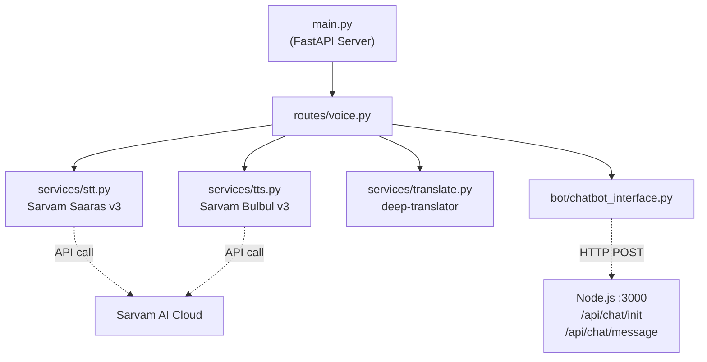

 # MAITRI BOT — Complete Project Documentation

> **MAITRI** (Maharashtra Industry, Trade and Investment Facilitation Cell) FAQ Chatbot with multilingual voice support (Marathi, Hindi, English).

---

## Table of Contents

1. [File Structure](#1-file-structure)
2. [AI Models & Services Used](#2-ai-models--services-used)
3. [How Files Connect](#3-how-files-connect)
4. [Detailed Project Flow](#4-detailed-project-flow)

---

## 1. File Structure

```
MAITRI_BOT/
├── .env                          # Root environment variables (Gemini API key, Ollama config, port)
├── package.json                  # Node.js dependencies & scripts
├── tsconfig.json                 # TypeScript compiler configuration
├── FAQ.md                        # 📚 The FAQ knowledge base (22 Q&A pairs about MAITRI)
├── OLDFAQ.MD                     # Archive of older/shorter FAQ content
├── vector_store.json             # 🧠 Pre-computed vector embeddings (from portal scraping)
├── test_gemini.js                # Standalone script to test Gemini API connectivity
├── Project Name ChatBot.md       # Project naming/description notes
├── README.md                     # General project readme
│
├── src/                          # 🟦 NODE.JS BACKEND (TypeScript + Express)
│   ├── index.ts                  #   ⭐ Server entry point — Express app, routes, proxy
│   ├── types/
│   │   └── index.ts              #   TypeScript interfaces (FaqEntry, ChatSession, FormState, etc.)
│   ├── routes/
│   │   ├── chatRoutes.ts         #   /api/chat/* endpoints (init, message, history, suggest)
│   │   ├── faqRoutes.ts          #   /api/faq/* endpoints (CRUD for FAQ entries)
│   │   └── formRoutes.ts         #   /api/forms/* endpoints (submit, list submissions)
│   ├── services/
│   │   ├── chatService.ts        #   ⭐ Core brain — LLM calls, session mgmt, greeting/form logic
│   │   ├── faqService.ts         #   Reads/writes FAQ.md, parses markdown into structured data
│   │   ├── formService.ts        #   Form definitions loader, field validation, trigger matching
│   │   └── formSubmissionStore.ts#   JSON file-based storage for form submissions
│   └── scripts/
│       └── ingest.ts             #   Web scraper — scrapes maitri portal → vector embeddings
│
├── MyBot/                        # 🐍 PYTHON BACKEND (FastAPI) — Voice Pipeline
│   ├── .env                      #   Python env vars (Sarvam API key, speakers, chatbot URL)
│   ├── main.py                   #   ⭐ FastAPI entry point — mounts voice routes, serves UI
│   ├── requirements.txt          #   Python dependencies
│   ├── bot/
│   │   ├── __init__.py
│   │   └── chatbot_interface.py  #   HTTP client that calls the Node.js /api/chat/* endpoints
│   ├── services/
│   │   ├── __init__.py
│   │   ├── stt.py                #   🎤 Speech-to-Text using Sarvam AI Saaras v3
│   │   ├── tts.py                #   🔊 Text-to-Speech using Sarvam AI Bulbul v3
│   │   └── translate.py          #   🌐 Language detection & translation (deep-translator)
│   ├── routes/
│   │   ├── __init__.py
│   │   └── voice.py              #   /api/voice/* endpoints (voice chat, text chat, languages)
│   └── public/                   #   Voice-specific frontend
│       ├── index.html            #   Voice chat web page
│       ├── voice-chat.js         #   Browser mic recording + API integration
│       └── voice-chat.css        #   Voice chat UI styling
│
├── public/                       # 🌐 NODE.JS FRONTEND (served by Express)
│   ├── index.html                #   Main FAQ page with floating chat widget + voice mic
│   └── demo.html                 #   Developer API demo page (Chat, FAQ CRUD, Raw API tabs)
│
├── forms/                        # 📋 Form Definitions (JSON)
│   └── user-registration.json    #   User registration form (name, email, phone, DOB)
│
├── data/                         # 💾 Persistent Data Storage
│   └── submissions.json          #   Stored form submissions
│
└── dist/                         # Compiled TypeScript output (auto-generated)
```

### Key Directories Explained

| Directory       | Technology           | Purpose                                                                   |
|-----------      |----------------------|---------------------------------------------------------------------------|
| `src/`          | TypeScript + Express | Core chatbot backend — FAQ retrieval, LLM processing, session management  |
| `MyBot/`        | Python + FastAPI     | Voice pipeline wrapper — STT, TTS, translation, proxies to Node.js        |
| `public/`       | HTML + JS            | Main user-facing frontend served by the Node.js server                    |
| `MyBot/public/` | HTML + JS + CSS      | Standalone voice-chat frontend served by the Python server                |
| `forms/`        | JSON                 | Declarative form definitions for conversational form-filling              |
| `data/`         | JSON                 | File-based persistence for form submissions                               |

---

## 2. AI Models & Services Used

### 2.1 Google Gemini 2.0 Flash (Primary LLM)

| Attribute        | Detail                                                                         |
|------------------|--------------------------------------------------------------------------------|
| **Purpose**      | Answer FAQ questions + translate to Hindi/Marathi in a **single API call**     |
| **Model**        | `gemini-2.0-flash`                                                             |
| **Used in**      | `src/services/chatService.ts` → `getGeminiReply()` and `translateReply()`      |
| **API**          | Google Generative Language REST API                                            |
| **Temperature**  | 0.1 (low creativity, high accuracy)                                            |
| **Key Features** | Rate-limit retry (429 → wait 2s → retry), response caching (up to 500 entries) |

**What it does:** Receives the full FAQ text + user question + language directive, then produces an answer directly in the user's language (Marathi/Hindi/English). This eliminates the need for a separate translation step.

### 2.2 Ollama + Qwen 2.5:3b (Local Fallback LLM)

| Attribute | Detail |
|-----------|--------|
| **Purpose** | Fallback when Gemini is unavailable (no API key, rate limited, network error) |
| **Model** | `qwen2.5:3b` (runs locally via Ollama) |
| **Used in** | `src/services/chatService.ts` → `sendMessage()` fallback path |
| **Library** | LangChain `ChatOllama` |
| **Temperature** | 0.2 |

**What it does:** Same FAQ-answering task as Gemini, but runs entirely on local hardware. Slower but works offline.

### 2.3 Ollama + BGE-M3 (Multilingual Embeddings)

| Attribute | Detail |
|-----------|--------|
| **Purpose** | Generate vector embeddings for RAG (Retrieval-Augmented Generation) |
| **Model** | `bge-m3` — a multilingual embedding model supporting 100+ languages |
| **Used in** | `src/scripts/ingest.ts` (ingestion) and `src/services/chatService.ts` → `getVectorContext()` (retrieval) |
| **Library** | LangChain `OllamaEmbeddings` |

**What it does:**
- **Ingestion:** Scrapes the MAITRI portal website, chunks the text, generates embeddings, and saves to `vector_store.json`
- **Retrieval:** When Ollama fallback is active, embeds the user's query and finds the top-3 most similar chunks using cosine similarity

### 2.4 Sarvam AI — Saaras v3 (Speech-to-Text)

| Attribute | Detail |
|-----------|--------|
| **Purpose** | Convert user's voice audio into text |
| **Model** | `saaras:v3` |
| **Used in** | `MyBot/services/stt.py` → `transcribe_audio()` |
| **Languages** | Marathi (`mr-IN`), Hindi (`hi-IN`), English (`en-IN`) |
| **Formats** | webm, ogg, mp4, wav, mp3 (no conversion needed) |

### 2.5 Sarvam AI — Bulbul v3 (Text-to-Speech)

| Attribute | Detail |
|-----------|--------|
| **Purpose** | Convert bot's text reply into natural-sounding audio |
| **Model** | `bulbul:v3` |
| **Used in** | `MyBot/services/tts.py` → `text_to_speech()` |
| **Speaker** | `neha` (female voice, configurable via env vars) |
| **Languages** | Marathi, Hindi, English (Indian accent) |
| **Max chars** | 2000 (truncates at sentence boundary if exceeded) |

### 2.6 Google Translate via deep-translator (Language Utils)

| Attribute | Detail |
|-----------|--------|
| **Purpose** | Language detection and text translation (used in the Python voice pipeline) |
| **Used in** | `MyBot/services/translate.py` |
| **Library** | `deep-translator` (GoogleTranslator) |

### 2.7 MyMemory Translation API (Last-Resort Fallback)

| Attribute | Detail |
|-----------|--------|
| **Purpose** | Free translation fallback if Gemini translation fails |
| **Used in** | `src/services/chatService.ts` → `translateReply()` |
| **API** | `api.mymemory.translated.net` (no API key required) |

### Model Decision Flowchart

```
User sends a message
       │
       ▼
Is GOOGLE_API_KEY set?
       │
  YES ─┤── ► Gemini 2.0 Flash (single call: answer + translate)
       │         │
       │    Returns 429?
       │         │
       │    YES ─┤── Retry after 2s
       │         │     │
       │         │  Still 429? → Fall to Ollama
       │         │
       │    Returns answer ✓
       │
  NO ──┤── ► Ollama qwen2.5:3b + BGE-M3 vector search
              (local, slower, uses vector_store.json)
```

---

## 3. How Files Connect

### 3.1 Node.js Backend — Import/Dependency Graph



### 3.2 Python Backend — Import/Dependency Graph



### 3.3 Cross-Server Communication

```
┌───────────────────────────────────────────────────────────────────┐
│                        BROWSER (User)                             │
│                                                                   │
│  public/index.html          MyBot/public/index.html               │
│  (FAQ page + chat widget)   (Voice chat page)                     │
│       │                           │                               │
│       │ fetch /api/chat/*         │ fetch /api/voice/*             │
│       │ fetch /api/faq            │                               │
│       │ fetch /api/voice/*        │                               │
└───────┼───────────────────────────┼───────────────────────────────┘
        │                           │
        ▼                           ▼
┌────────────────────┐    ┌────────────────────┐
│  Node.js :3000     │    │  Python :8000      │
│  (Express)         │◄───│  (FastAPI)         │
│                    │    │                    │
│  /api/chat/*       │    │  /api/voice/*      │
│  /api/faq          │    │                    │
│  /api/forms/*      │    │  Uses httpx to     │
│  /api/register     │    │  call Node.js      │
│                    │    │  /api/chat/message  │
│  Proxy: /api/voice │    │                    │
│  ──────────────►   │    │                    │
└────────────────────┘    └────────────────────┘
```

**Key connections:**
1. **Node.js proxies voice requests** → `/api/voice/*` requests from `public/index.html` are forwarded to Python `:8000` via `http-proxy-middleware`
2. **Python calls Node.js for chat** → `chatbot_interface.py` makes HTTP POST to `http://localhost:3000/api/chat/message`
3. **Both servers serve their own frontend** — Node.js serves `public/`, Python serves `MyBot/public/`

---

## 4. Detailed Project Flow

### 4.1 Startup Sequence

```
Step 1: Start Node.js server
   $ npm run dev  (or: ts-node src/index.ts)
   → Loads .env (GOOGLE_API_KEY, OLLAMA settings, PORT=3000)
   → Configures Express middleware (CORS, JSON parser)
   → Sets up proxy: /api/voice/* → http://127.0.0.1:8000
   → Mounts routes: /api/faq, /api/chat, /api/forms, /api/register
   → Serves static files from public/
   → Listens on port 3000

Step 2: Start Python server
   $ cd MyBot && python main.py
   → Loads MyBot/.env (SARVAM_API_KEY, CHATBOT_API_URL, speakers)
   → Creates FastAPI app with CORS middleware
   → Mounts voice routes at /api/voice
   → Serves MyBot/public/ as static files
   → Runs uvicorn on port 8000
```

### 4.2 Text Chat Flow (Main FAQ Chatbot)

```
User types: "What is MAITRI?"
           │
           ▼
  ┌─ Browser (index.html) ─────────────────────────────────────┐
  │  1. User clicks FAB button → opens chat popup              │
  │  2. ensureSession() → POST /api/chat/init                  │
  │     Server returns { sessionId: "session-xxx-123" }         │
  │  3. User types message, hits Send                          │
  │  4. POST /api/chat/message { sessionId, message }          │
  └────────────────────────────────────────────────────────────┘
           │
           ▼
  ┌─ chatRoutes.ts ────────────────────────────────────────────┐
  │  Receives POST /api/chat/message                           │
  │  Validates sessionId and message                           │
  │  Calls: sendMessage(sessionId, message, language)          │
  └────────────────────────────────────────────────────────────┘
           │
           ▼
  ┌─ chatService.ts → sendMessage() ───────────────────────────┐
  │                                                             │
  │  Step 1: Append user message to session history             │
  │                                                             │
  │  Step 2: Check if user is filling a form → handleFormFlow() │
  │          If yes → validate field, ask next question, return  │
  │                                                             │
  │  Step 3: Check if message matches form trigger phrase       │
  │          e.g. "register" → starts user-registration form    │
  │                                                             │
  │  Step 4: Check if it's a greeting                          │
  │          "hello", "नमस्कार" → return greeting in user's lang│
  │                                                             │
  │  Step 5: Load FAQ text (cached from FAQ.md on first call)   │
  │                                                             │
  │  Step 6: Detect user's language (Devanagari? → mr/hi, else en)│
  │                                                             │
  │  Step 7: Try Gemini API (if API key available)              │
  │    → Builds prompt with FAQ content + language directives   │
  │    → Checks response cache first (avoids duplicate calls)   │
  │    → Single API call: answer + translate combined           │
  │    → If 429 rate limited: retry once after 2s               │
  │                                                             │
  │  Step 8: If Gemini fails → Ollama fallback                  │
  │    → Runs BGE-M3 vector search for extra context            │
  │    → Calls ChatOllama (qwen2.5:3b) with LangChain messages  │
  │                                                             │
  │  Step 9: Append assistant reply to session history          │
  │  Step 10: Check if reply offers a form → set offeredFormId   │
  │  Step 11: Format reply to HTML (markdown links → <a>, lists)│
  │  Return HTML reply to browser                               │
  └─────────────────────────────────────────────────────────────┘
           │
           ▼
  Browser renders reply in chat widget with HTML formatting
```

### 4.3 Voice Chat Flow

```
User taps 🎙️ mic button and speaks in Marathi
           │
           ▼
  ┌─ Browser (index.html or voice-chat.js) ────────────────────┐
  │  1. getUserMedia() → start MediaRecorder (webm/opus)       │
  │  2. User taps ⏹️ → stop recording                          │
  │  3. Build FormData with audio blob + language hint          │
  │  4. POST /api/voice (multipart/form-data)                  │
  └────────────────────────────────────────────────────────────┘
           │
           ▼  (proxied by Node.js to Python :8000)
           │
  ┌─ voice.py → voice_chat() ─────────────────────────────────┐
  │                                                             │
  │  Step 1: Read uploaded audio (validate size ≤ 10MB)        │
  │                                                             │
  │  Step 2: STT — stt.py → transcribe_audio()                 │
  │    → Sends audio to Sarvam AI Saaras v3                    │
  │    → Returns: { transcript, detected_language, confidence } │
  │    → e.g. { "मैत्री म्हणजे काय?", "mr-IN", null }          │
  │                                                             │
  │  Step 3: Detect/normalize language → "mr"                   │
  │                                                             │
  │  Step 4: Core Pipeline (_run_core_pipeline)                 │
  │    │                                                        │
  │    ├─ 4a: Send native text to Node.js chatbot              │
  │    │   → chatbot_interface.py → POST /api/chat/message      │
  │    │   → Passes language hint so Gemini answers in Marathi  │
  │    │   → Gets Marathi answer back                           │
  │    │                                                        │
  │    ├─ 4b: Strip HTML tags from response (BeautifulSoup)    │
  │    │                                                        │
  │    └─ 4c: TTS — tts.py → text_to_speech()                  │
  │        → Sends Marathi text to Sarvam AI Bulbul v3         │
  │        → Speaker: "neha" (female voice)                     │
  │        → Returns WAV audio bytes                            │
  │                                                             │
  │  Step 5: Encode audio as base64                             │
  │  Step 6: Return JSON with audio + all text fields           │
  └─────────────────────────────────────────────────────────────┘
           │
           ▼
  ┌─ Browser ──────────────────────────────────────────────────┐
  │  1. Update chat bubble with transcript text                │
  │  2. Show bot's translated answer text                      │
  │  3. Auto-play base64 audio response                        │
  │     (falls back to "Play" button if autoplay blocked)      │
  └────────────────────────────────────────────────────────────┘
```

### 4.4 Form-Filling Flow (Conversational)

```
User: "I want to register"
  → matchFormTrigger() finds "user-registration" form
  → startForm() sets formState = { formId, stepIndex: 0, data: {}, userLang }
  → Bot asks: "What is your full name?"

User: "Ajinkya Patil"
  → handleFormFlow() validates (not just numbers, min 2 chars)
  → Stores data.fullName = "Ajinkya Patil"
  → stepIndex → 1
  → Bot asks: "What is your email address?"

User: "ajinkya@example.com"
  → validates email format
  → Stores data.email
  → Bot asks: "What is your phone number? (optional)"

User: "9876543210"
  → validates tel format
  → Stores data.phone
  → Bot asks: "What is your date of birth?"

User: "15 Jan 1990"
  → parseFlexibleDate() → "1990-01-15"
  → Stores data.dateOfBirth
  → All fields collected!
  → submitForm() → POST to http://localhost:3000/api/register
  → formSubmissionStore saves to data/submissions.json
  → Bot: "Thank you. Your User Registration has been submitted successfully."

At any point, user can say "cancel" / "रद्द" / "बंद करो" to abort.
```

### 4.5 Data Ingestion Flow (RAG Pipeline)

```
Run: npx ts-node src/scripts/ingest.ts
           │
           ▼
  ┌─ ingest.ts ────────────────────────────────────────────────┐
  │  1. Scrape https://maitri.maharashtra.gov.in/ using Cheerio│
  │  2. Split scraped text into 1000-char chunks (200 overlap)  │
  │  3. Generate embeddings using Ollama BGE-M3 model           │
  │  4. Save [{pageContent, embedding},...] to vector_store.json│
  └─────────────────────────────────────────────────────────────┘
           │
           ▼
  vector_store.json (~600KB) is used at runtime by
  chatService.ts → getVectorContext() for semantic search
  (only when Ollama fallback is active, not with Gemini)
```

### 4.6 Complete System Architecture

```
╔══════════════════════════════════════════════════════════════════════╗
║                         USER'S BROWSER                              ║
║                                                                      ║
║  ┌──────────────────┐          ┌──────────────────────┐             ║
║  │  index.html       │          │  MyBot/public/        │             ║
║  │  (FAQ + Chat      │          │  index.html           │             ║
║  │   Widget + Voice) │          │  (Voice Chat UI)      │             ║
║  └────────┬─────────┘          └──────────┬───────────┘             ║
╚═══════════╪══════════════════════════════╪═══════════════════════════╝
            │                               │
     /api/chat, /api/faq              /api/voice
     /api/voice (proxied)                   │
            │                               │
            ▼                               ▼
┌─────────────────────┐        ┌─────────────────────────┐
│   NODE.JS :3000     │        │   PYTHON :8000           │
│   Express + TS      │◄───────│   FastAPI                │
│                     │  HTTP  │                          │
│ ┌─────────────────┐ │        │ ┌──────────────────────┐ │
│ │  chatService.ts │ │        │ │  routes/voice.py     │ │
│ │  (FAQ + LLM)    │ │        │ │  (Pipeline orchestr.)│ │
│ └────────┬────────┘ │        │ └──────┬───────────────┘ │
│          │          │        │        │                  │
│    ┌─────┴──────┐   │        │  ┌─────┴───────────┐     │
│    │ Gemini API │   │        │  │ Sarvam AI Cloud  │     │
│    │ (primary)  │   │        │  │  STT (Saaras v3) │     │
│    └────────────┘   │        │  │  TTS (Bulbul v3) │     │
│    ┌────────────┐   │        │  └──────────────────┘     │
│    │ Ollama     │   │        │                          │
│    │ (fallback) │   │        │ ┌──────────────────────┐ │
│    │ qwen2.5:3b │   │        │ │ chatbot_interface.py │ │
│    │ bge-m3     │   │        │ │ (calls Node.js API)  │ │
│    └────────────┘   │        │ └──────────────────────┘ │
│                     │        │                          │
│ ┌─────────────────┐ │        └──────────────────────────┘
│ │ FAQ.md          │ │
│ │ vector_store.json│ │
│ │ forms/*.json    │ │
│ │ data/*.json     │ │
│ └─────────────────┘ │
└─────────────────────┘
```

### 4.7 Environment Variables Summary

| Variable | File | Purpose |
|----------|------|---------|
| `GOOGLE_API_KEY` | `.env` + `MyBot/.env` | Gemini API authentication |
| `OLLAMA_BASE_URL` | `.env` | Ollama server URL (default: localhost:11434) |
| `OLLAMA_MODEL` | `.env` | LLM model name (default: qwen2.5:3b) |
| `PORT` | `.env` | Node.js server port (default: 3000) |
| `SARVAM_API_KEY` | `MyBot/.env` | Sarvam AI authentication for STT + TTS |
| `SARVAM_SPEAKER_MR/HI/EN` | `MyBot/.env` | TTS voice selection per language |
| `CHATBOT_API_URL` | `MyBot/.env` | Node.js server URL for Python to call |
| `APP_HOST` / `APP_PORT` | `MyBot/.env` | Python server bind address (default: 0.0.0.0:8000) |

### 4.8 API Endpoints Summary

#### Node.js Server (`:3000`)

| Method | Endpoint | Purpose |
|--------|----------|---------|
| POST | `/api/chat/init` | Create a new chat session |
| POST | `/api/chat/message` | Send message, get AI reply |
| POST | `/api/chat/end` | End a chat session |
| GET | `/api/chat/history/:sessionId` | Get chat history (HTML formatted) |
| GET | `/api/chat/suggest/:sessionId?` | Get suggested questions |
| GET | `/api/faq` | List all FAQ entries |
| POST | `/api/faq` | Add a new FAQ entry |
| PUT | `/api/faq/:id` | Update an FAQ entry |
| DELETE | `/api/faq/:id` | Delete an FAQ entry |
| POST | `/api/forms/submit` | Store a form submission |
| GET | `/api/forms/submissions` | List form submissions |
| POST | `/api/register` | User registration endpoint |
| GET | `/health` | Health check |

#### Python Server (`:8000`)

| Method | Endpoint | Purpose |
|--------|----------|---------|
| POST | `/api/voice` | Full voice pipeline: Audio → STT → Bot → TTS → Audio |
| POST | `/api/voice/text` | Text → Bot → TTS → Audio (no STT needed) |
| GET | `/api/voice/languages` | List supported languages |
| GET | `/health` | Health check |
| GET | `/docs` | Swagger UI documentation |

---

*Document generated on 2026-04-24. Reflects the current state of the MAITRI_BOT codebase.*
