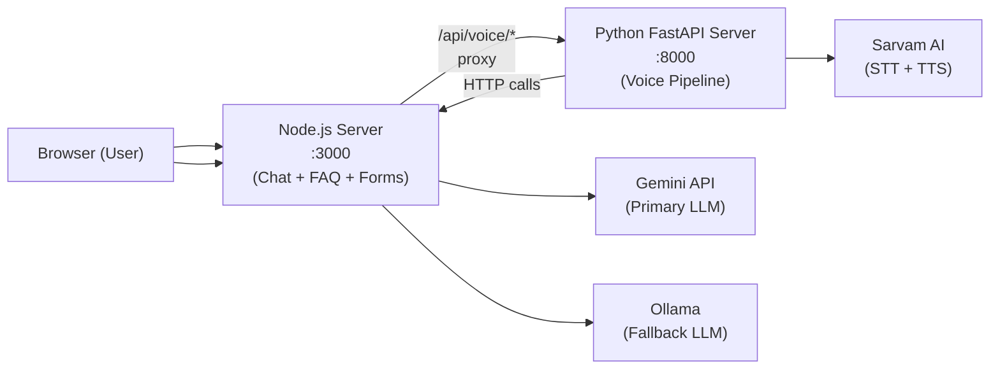
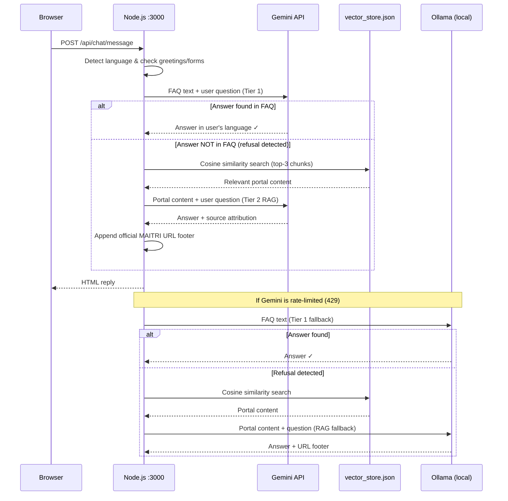
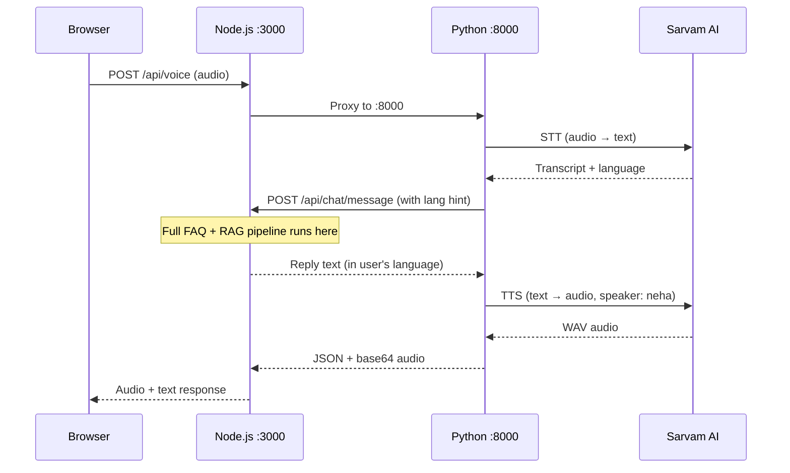

# MAITRI_BOT — Complete Project Structure Explained

## High-Level Architecture

This project is a **multilingual FAQ chatbot** for **MAITRI** (Maharashtra Industry, Trade and Investment Facilitation Cell). It consists of **two servers** that work together:

| Server | Port | Language | Purpose |
|--------|------|----------|---------|
| **Node.js** (root) | 3000 | TypeScript | FAQ chatbot brain, REST API, form-filling, web frontend |
| **Python** (`MyBot/`) | 8000 | Python | Voice pipeline — speech-to-text, text-to-speech, translation |

---

## Root Directory: `MAITRI_BOT/`

### Configuration & Metadata Files

#### [.env](file:///c:/Users/Ajinkya/Desktop/MAITRI_BOT/.env)
**Environment variables for the Node.js server.** Contains:
- `GOOGLE_API_KEY` — Gemini API key used for FAQ answering and Hindi/Marathi translation
- `OLLAMA_BASE_URL` / `OLLAMA_MODEL` — Local Ollama LLM settings (fallback when Gemini fails)
- `PORT` — Node.js server port (3000)

#### [package.json](file:///c:/Users/Ajinkya/Desktop/MAITRI_BOT/package.json)
**Node.js project manifest.** Defines:
- **Scripts**: `dev` (runs with ts-node), `build` (tsc compile), `start` (run compiled JS)
- **Key dependencies**:
  - `langchain` + `@langchain/ollama` — LLM integration framework
  - `express` — HTTP server
  - `express-rate-limit` — API rate limiting
  - `http-proxy-middleware` — Proxies `/api/voice/*` to Python server
  - `cheerio` — HTML parsing for web scraping
  - `pdf-parse` — PDF document parsing
  - `cors`, `dotenv` — Standard utilities

#### [tsconfig.json](file:///c:/Users/Ajinkya/Desktop/MAITRI_BOT/tsconfig.json)
**TypeScript compiler configuration.** Targets ES2022, uses CommonJS modules. Source in `src/`, compiled output in `dist/`.

#### [vector_store.json](file:///c:/Users/Ajinkya/Desktop/MAITRI_BOT/vector_store.json) *(597 KB)*
**Pre-computed vector embeddings** of the MAITRI portal website content. Generated by the ingestion script (`src/scripts/ingest.ts`). Contains 44 document chunks from `maitri.maharashtra.gov.in`, each stored as `{pageContent, embedding}`. This is the **RAG fallback knowledge base** — when a user asks something not covered by `FAQ.md`, the bot performs semantic search over this store to find an answer and attributes it to the official website.

#### [test_gemini.js](file:///c:/Users/Ajinkya/Desktop/MAITRI_BOT/test_gemini.js)
**Standalone test script** to verify Gemini API connectivity. Sends a Hindi question to Gemini Flash and prints the response. Used for debugging API key issues.

---

### Knowledge Base Files

#### [FAQ.md](file:///c:/Users/Ajinkya/Desktop/MAITRI_BOT/FAQ.md)
**The primary knowledge base.** Contains 22+ Q&A pairs about MAITRI organized into categories:
- **A.** About MAITRI and its role
- **B.** Legal framework (MAITRI Act 2023, Rules 2025)
- **C.** Approvals & application process
- **D.** Investor support & grievance redressal
- **E.** Sectoral & strategic facilitation (Ultra Mega/Mega projects)
- **F.** Digital & technical support
- **G.** Events & investment promotion

Format: `## Q: Question` followed by `A: Answer`. This file is the **first source** the chatbot consults. If the answer is not found here, the bot automatically falls back to searching `vector_store.json` (scraped from the MAITRI portal) before giving up.

#### [OLDFAQ.MD](file:///c:/Users/Ajinkya/Desktop/MAITRI_BOT/OLDFAQ.MD)
**Legacy/sample FAQ** with generic placeholder questions (business hours, password reset, payments). This was the original demo FAQ before MAITRI-specific content was added. Not actively used.

---

### Documentation Files

#### [README.md](file:///c:/Users/Ajinkya/Desktop/MAITRI_BOT/README.md)
**Setup and usage guide.** Documents all API endpoints, form-by-chat feature, FAQ format, and how to run the project.

#### [PROJECT_DOCUMENTATION.md](file:///c:/Users/Ajinkya/Desktop/MAITRI_BOT/PROJECT_DOCUMENTATION.md)
**Comprehensive project documentation** covering architecture, features, and technical details.

#### [Project Name ChatBot.md](file:///c:/Users/Ajinkya/Desktop/MAITRI_BOT/Project%20Name%20ChatBot.md)
**Original project specification/brief.** The initial requirements document that defined the chatbot's features: FAQ-based answers, REST API, chat sessions, form management.

---

## `src/` — Node.js TypeScript Source Code

This is the **core chatbot backend** written in TypeScript.

### [src/index.ts](file:///c:/Users/Ajinkya/Desktop/MAITRI_BOT/src/index.ts) — Main Entry Point
**The Express.js server setup.** Responsibilities:
1. **Rate limiters** — Separate rate limits for chat messages (15/min), session init (10/min), and voice (10/min)
2. **Voice proxy** — Proxies `/api/voice/*` requests to the Python server at port 8000 (must be before body parsers since it forwards raw audio)
3. **Route mounting** — `/api/faq`, `/api/chat`, `/api/forms`
4. **Registration endpoint** — `POST /api/register` saves form data to `data/submissions.json`
5. **Health check** — `GET /health`
6. **Warm-up** — On startup, pre-loads FAQ cache, response cache, form definitions, and vector store

---

### `src/routes/` — API Route Handlers

#### [chatRoutes.ts](file:///c:/Users/Ajinkya/Desktop/MAITRI_BOT/src/routes/chatRoutes.ts)
**Chat API endpoints:**
| Method | Path | Purpose |
|--------|------|---------|
| `POST` | `/api/chat/init` | Create a new chat session (extracts client IP) |
| `POST` | `/api/chat/end` | Delete/end a chat session |
| `POST` | `/api/chat/message` | Send a user message, get AI reply (accepts optional `language` hint) |
| `GET` | `/api/chat/history/:sessionId` | Retrieve full chat history (assistant messages converted to HTML) |
| `GET` | `/api/chat/suggest/:sessionId?` | Get random suggested questions from FAQ |

#### [faqRoutes.ts](file:///c:/Users/Ajinkya/Desktop/MAITRI_BOT/src/routes/faqRoutes.ts)
**FAQ CRUD API endpoints:**
| Method | Path | Purpose |
|--------|------|---------|
| `GET` | `/api/faq` | List all FAQ entries |
| `POST` | `/api/faq` | Add a new Q&A pair (writes to `FAQ.md`) |
| `PUT` | `/api/faq/:id` | Update an existing FAQ entry |
| `DELETE` | `/api/faq/:id` | Delete a FAQ entry |

#### [formRoutes.ts](file:///c:/Users/Ajinkya/Desktop/MAITRI_BOT/src/routes/formRoutes.ts)
**Form submission endpoints:**
| Method | Path | Purpose |
|--------|------|---------|
| `POST` | `/api/forms/submit` | Store a generic form submission |
| `GET` | `/api/forms/submissions` | List submissions (optional `formId` filter) |

#### [chatService.ts](file:///c:/Users/Ajinkya/Desktop/MAITRI_BOT/src/services/chatService.ts) *(953 lines — the heart of the bot)*
**The core chatbot intelligence.** This is the largest and most important file. Key capabilities:

1. **Language Detection** (`detectLanguage`) — Detects Marathi, Hindi, or English using Devanagari script detection and Marathi-specific characters (ळ, ऱ)

2. **Session Management** — In-memory `Map<sessionId, ChatSession>` with:
   - Auto-cleanup every 10 minutes (sessions expire after 2 hours)
   - Session creation from IP/userId

3. **Three-Tier Answer Strategy** (`sendMessage`):
   - **Tier 1 — FAQ (Strict):** Sends the full `FAQ.md` content to Gemini. If Gemini finds a matching answer, it returns it directly in the user's language.
   - **Tier 2 — RAG Fallback:** If Gemini (or Ollama) returns an out-of-FAQ refusal, `isOutOfFaqReply()` detects it. The bot then searches `vector_store.json` using cosine similarity (`getVectorContext()`), passes the top-3 results to `getGeminiRagReply()` with a portal-knowledge prompt, and returns an answer **attributed to the MAITRI website** with the footer: *"For more information visit official website of MAITRI (https://maitri.maharashtra.gov.in/)"*
   - **Tier 3 — Ollama Local Fallback:** If Gemini is rate-limited (429) or unavailable, Ollama (`qwen2.5:3b`) handles both FAQ answering and RAG fallback with the same two-tier logic.

4. **Out-of-FAQ Detection** (`isOutOfFaqReply`) — Detects refusal phrases in English, Hindi, and Marathi so the bot knows when to trigger RAG search instead of displaying the refusal.

5. **RAG Reply Generation** (`getGeminiRagReply`) — A dedicated Gemini call with a "portal knowledge" prompt. Uses vector store context instead of FAQ. Appends a source attribution line (`Source: MAITRI Official Website`) in the user's language and is cached with a `rag::` prefix key.

6. **Multilingual Footer** (`getMoreInfoFooter`) — Appends the official MAITRI URL in the user's language (English/Hindi/Marathi) at the end of every RAG-sourced answer.

7. **Response Caching** — Persistent response cache (`data/response_cache.json`):
   - Up to 500 cached responses (FAQ and RAG responses cached separately with `rag::` prefix)
   - Debounced disk writes (every 60s)
   - Cache key includes language + question + recent history
   - Survives server restarts

8. **Vector Search** (`getVectorContext`) — Loads `vector_store.json` (44 portal docs) into memory, generates query embeddings via Ollama BGE-M3, computes cosine similarity, returns top-3 matches as context

9. **Greeting Detection** — Intercepts greetings in English/Hindi/Marathi and responds with a welcoming message in the user's language

10. **Form-Filling Flow** — Conversational form filling:
    - Detects trigger phrases (e.g., "register", "नोंदणी")
    - Asks each form field one by one with localized labels
    - Validates inputs (email, phone, date with flexible parsing)
    - Submits to the form's configured URL
    - Supports cancel commands in all languages

11. **HTML Formatting** (`formatReplyToHtml`) — Converts markdown-style responses to safe HTML (links, lists, escape XSS)

12. **Warm-up** — Pre-loads all caches on server start for fast first request

13. **Translation Fallback** — If Gemini single-shot fails, can translate via MyMemory free API

#### [faqService.ts](file:///c:/Users/Ajinkya/Desktop/MAITRI_BOT/src/services/faqService.ts)
**FAQ file I/O.** Handles:
- **Parsing** `FAQ.md` into structured `FaqEntry[]` (splits on `## Q:` headers)
- **Serialization** back to markdown
- **CRUD** operations (add, update, delete) with immediate file writes
- **Context extraction** — Converts all FAQs to plain text for LLM context

#### [formService.ts](file:///c:/Users/Ajinkya/Desktop/MAITRI_BOT/src/services/formService.ts)
**Form definition engine.** Handles:
- **Loading** form definitions from `forms/*.json` (cached in memory)
- **Trigger matching** — Checks if user message matches form trigger phrases (exact match for short phrases, substring for longer ones)
- **Offer detection** — Detects if bot's reply contains a form offer question
- **Field validation** — Validates text, email, phone, number, date fields with flexible date parsing (handles DD/MM/YYYY, "15 Jan 1990", etc.)
- **Form submission** — HTTP POST to the form's configured `submitUrl`

#### [formSubmissionStore.ts](file:///c:/Users/Ajinkya/Desktop/MAITRI_BOT/src/services/formSubmissionStore.ts)
**Simple JSON-file database** for form submissions. Reads/writes `data/submissions.json`. Each submission gets a unique ID and timestamp.

---

### `src/types/`

#### [index.ts](file:///c:/Users/Ajinkya/Desktop/MAITRI_BOT/src/types/index.ts)
**TypeScript interfaces** for the entire project:
- `FaqEntry` — FAQ question/answer with ID
- `ChatMessage` — User or assistant message with timestamp
- `ChatSession` — Session with messages, form state, offered form tracking
- `FormState` — In-progress form: current step, collected data, user language
- `FormFieldDef` — Field definition with multilingual labels (English/Marathi/Hindi)
- `FormDefinition` — Complete form with trigger phrases, offer questions, fields, submit URL

---

### `src/scripts/`

#### [ingest.ts](file:///c:/Users/Ajinkya/Desktop/MAITRI_BOT/src/scripts/ingest.ts)
**Web scraping & vector ingestion pipeline.** Steps:
1. Scrapes `https://maitri.maharashtra.gov.in/` using Cheerio
2. Splits content into 1000-char chunks (200 overlap) using LangChain's `RecursiveCharacterTextSplitter`
3. Generates embeddings using Ollama's `bge-m3` model (multilingual — supports Marathi/Hindi)
4. Saves to `vector_store.json` as `{pageContent, embedding}[]`

> This creates the supplementary knowledge base beyond FAQ.md

---

## `dist/` — Compiled JavaScript Output

Contains the compiled JavaScript versions of all TypeScript files. Generated by `npm run build` (tsc). Mirrors the `src/` structure:
- `dist/index.js` + `dist/index.d.ts`
- `dist/routes/`, `dist/services/`, `dist/types/`

---

## `public/` — Node.js Frontend (Served at port 3000)

#### [index.html](file:///c:/Users/Ajinkya/Desktop/MAITRI_BOT/public/index.html) *(917 lines)*
**The main production frontend.** A government-style FAQ page with:
- **Header** — Government blue theme with gold accent
- **FAQ Accordion** — Loads all FAQs from the API, renders as expandable sections
- **Floating Chat Button (FAB)** — WhatsApp-style bubble in bottom-right corner
- **Chat Popup** — Non-modal chat window with:
  - Text input + send button
  - Microphone button for voice input (records WebM audio)
  - Language selector (Auto-detect / Marathi / Hindi / English)
  - Thinking animation while waiting for response
  - Audio playback of bot's spoken response
  - Suggestion buttons
- **Voice Integration** — Records audio, sends to `/api/voice`, plays back TTS response

#### [demo.html](file:///c:/Users/Ajinkya/Desktop/MAITRI_BOT/public/demo.html) *(366 lines)*
**Developer/testing frontend.** A tabbed interface with:
- **Chat tab** — Simple chat interface for testing the chat API
- **FAQ tab** — View all FAQs + add new ones via form
- **Raw API tab** — Lists all available API endpoints for reference
- Dark theme with minimal styling

---

## `forms/` — Form Definitions

#### [user-registration.json](file:///c:/Users/Ajinkya/Desktop/MAITRI_BOT/forms/user-registration.json)
**User registration form definition.** Defines:
- **Trigger phrases** — 28 phrases in English, Marathi, and Hindi (e.g., "register", "नोंदणी", "पंजीकरण")
- **Offer questions** — 8 variations the bot might use to offer the form
- **Fields** (4 total, each with trilingual labels):
  1. `fullName` (text, required, 2-100 chars)
  2. `email` (email, required)
  3. `phone` (tel, optional)
  4. `dateOfBirth` (date, required)
- **Submit URL** — `http://localhost:3000/api/register`

---

## `data/` — Runtime Data Storage

#### [submissions.json](file:///c:/Users/Ajinkya/Desktop/MAITRI_BOT/data/submissions.json)
**JSON database of form submissions.** Contains 11 user registration submissions with full name, email, phone, date of birth, and timestamp. New entries are appended by `formSubmissionStore.ts`.

> A `response_cache.json` file is also created here at runtime to persist the Gemini response cache across restarts.

---

## `MyBot/` — Python Voice Server

This is the **voice pipeline** — a separate FastAPI server that handles speech I/O.

### Configuration Files

#### [.env](file:///c:/Users/Ajinkya/Desktop/MAITRI_BOT/MyBot/.env)
**Environment variables for the Python server:**
- `CHATBOT_API_URL` — URL of the Node.js server (`http://localhost:3000`)
- `GOOGLE_API_KEY` — Same Gemini key
- `SARVAM_API_KEY` — Sarvam AI API key for STT and TTS
- `SARVAM_SPEAKER_*` — TTS voice configuration (all set to "neha" — natural female voice)
- `APP_HOST`/`APP_PORT` — Server binding (127.0.0.1:8000)
- `SUPPORTED_LANGUAGES` — mr, hi, en
- `DEBUG` — Enables hot-reload and verbose logging

#### [requirements.txt](file:///c:/Users/Ajinkya/Desktop/MAITRI_BOT/MyBot/requirements.txt)
**Python dependencies:**
- `fastapi` + `uvicorn` — Web framework
- `sarvamai` — Sarvam AI SDK (STT + TTS)
- `httpx` — Async HTTP client (calls Node.js API)
- `deep-translator` — Google Translate wrapper (language detection + translation)
- `beautifulsoup4` — HTML stripping from bot responses
- `python-dotenv` — Environment variable loading
- `python-multipart` — File upload handling

#### [main.py](file:///c:/Users/Ajinkya/Desktop/MAITRI_BOT/MyBot/main.py)
**FastAPI application entry point.** Sets up:
- CORS middleware (allows all origins)
- Voice routes mounting
- Static file serving from `MyBot/public/`
- Health check endpoint (`/health`)
- Lifespan logging (startup/shutdown)
- Runs via `uvicorn` on port 8000 with hot-reload in debug mode

---

### `MyBot/bot/` — Chatbot Interface

#### [chatbot_interface.py](file:///c:/Users/Ajinkya/Desktop/MAITRI_BOT/MyBot/bot/chatbot_interface.py)
**Bridge between the voice server and the Node.js chatbot.** Functions:
- `_init_session()` — Creates a new chat session via `POST /api/chat/init`
- `get_bot_response()` — Sends user text to `POST /api/chat/message`, receives HTML reply, strips HTML to plain text using BeautifulSoup (so TTS reads clean text)
- Handles session expiration (auto-retries with new session on 404)
- 120-second timeout for slow Ollama responses

---

### `MyBot/routes/` — Voice API Routes

#### [voice.py](file:///c:/Users/Ajinkya/Desktop/MAITRI_BOT/MyBot/routes/voice.py)
**The voice pipeline orchestrator.** Three endpoints:

| Method | Path | Purpose |
|--------|------|---------|
| `POST` | `/api/voice` | **Full voice pipeline**: Audio → STT → Bot → TTS → Audio |
| `POST` | `/api/voice/text` | **Text fallback**: Text → Bot → TTS → Audio (no mic needed) |
| `GET` | `/api/voice/languages` | Returns supported languages list |

**Pipeline steps** (shared `_run_core_pipeline`):
1. Pass user text/transcript directly to Node.js bot with language hint
2. Bot responds in the user's native language (Gemini does it in one shot)
3. Convert bot's text response to speech via Sarvam TTS
4. Return base64-encoded audio + all metadata in JSON

Also handles: audio format detection from MIME type, language code normalization (e.g., `mr-IN` → `mr`), 10MB file size limit.

---

### `MyBot/services/` — Voice Processing Services

#### [stt.py](file:///c:/Users/Ajinkya/Desktop/MAITRI_BOT/MyBot/services/stt.py) — Speech-to-Text
**Converts audio to text using Sarvam AI Saaras v3.** Features:
- Accepts all browser audio formats (webm, ogg, wav, mp4, mp3) — no conversion needed
- Language code mapping (BCP-47 → Sarvam format)
- Error handling for: invalid audio (422), bad credentials (403), rate limits (429)
- Returns transcript + detected language

#### [tts.py](file:///c:/Users/Ajinkya/Desktop/MAITRI_BOT/MyBot/services/tts.py) — Text-to-Speech
**Converts text to spoken audio using Sarvam AI Bulbul v3.** Features:
- Supports 30+ natural-sounding Indian language voices
- Configurable speaker per language via env vars (defaults to "neha" for all)
- Graceful truncation at 2000 chars (finds last sentence break)
- Returns WAV audio bytes
- Error handling for API issues

#### [translate.py](file:///c:/Users/Ajinkya/Desktop/MAITRI_BOT/MyBot/services/translate.py) — Translation
**Language detection and translation using Google Translate (free).** Functions:
- `detect_language()` — Detects language using `deep-translator`'s Google detection
- `translate_to_english()` — Translates Marathi/Hindi to English
- `translate_from_english()` — Translates English to Marathi/Hindi
- Language normalization (`mr-IN` → `mr`)

> **Note:** Currently the main pipeline sends user text directly to the bot (which uses Gemini to answer in the user's language), so explicit translation is largely bypassed in the happy path.

---

### `MyBot/public/` — Voice Chat Frontend (Served at port 8000)

#### [index.html](file:///c:/Users/Ajinkya/Desktop/MAITRI_BOT/MyBot/public/index.html)
**Standalone voice chat page.** A dedicated page for voice-first interaction with:
- MAITRI header with online status indicator
- Language selector dropdown
- Chat message area with typing indicator
- Text input with send button
- Large microphone button with recording timer
- Uses Noto Sans + Noto Sans Devanagari fonts

#### [voice-chat.css](file:///c:/Users/Ajinkya/Desktop/MAITRI_BOT/MyBot/public/voice-chat.css) *(11 KB)*
**Styles for the voice chat UI.** Government theme with saffron/orange accents, recording animations, responsive layout.

#### [voice-chat.js](file:///c:/Users/Ajinkya/Desktop/MAITRI_BOT/MyBot/public/voice-chat.js) *(15 KB)*
**Voice chat frontend logic.** Handles:
- MediaRecorder API for audio capture
- Sending audio/text to `/api/voice` or `/api/voice/text`
- Playing back TTS audio responses
- Auto-session management
- Recording timer and state management

---

## `__MACOSX/` — macOS Metadata
Auto-generated macOS resource fork files (can be safely ignored/deleted).

---

## `myenv/` (inside `MyBot/`)
**Python virtual environment** directory containing installed Python packages.

---

## Data Flow Summary

### Text Chat (with RAG Fallback)

### Voice Chat Flow

